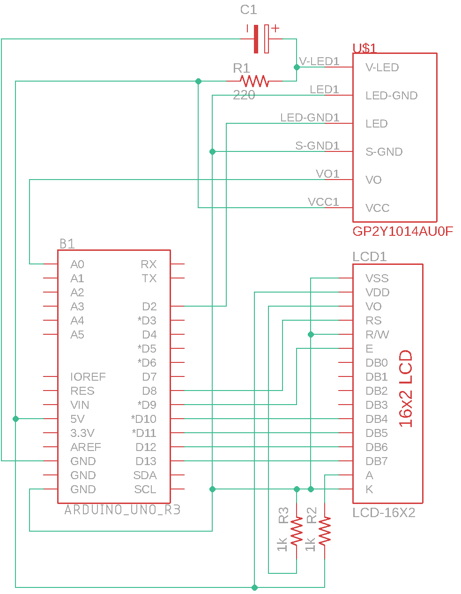

# arduino-dust-density-meter
The firmware for arduino which developed for an experience booth at the Science and Technology Festival Hall of the 2018 Ulsan Education Exhibition

## Info
- schematic

## H/W Spec
- Arduino uno × 1
- 1602 LCD × 1
- Sharp GP2Y1014AU0F × 1
- 220uF (capacitor) × 1
- 150ohm (resistance) × 1
- 1Kohm (resistance) × 2

## Ddependency Library
- DustDensitySensor [[Download](https://github.com/nulLeeKH/arduino-optical-dust-sensor-library)]

## Patch Note

### v1.0.0-alpha
- Initial release

### v1.1.0-alpha
- Split the DustDensitySensor library
